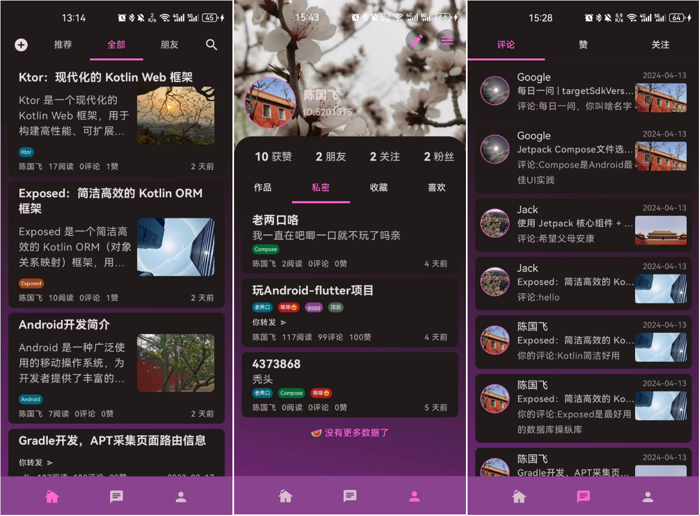
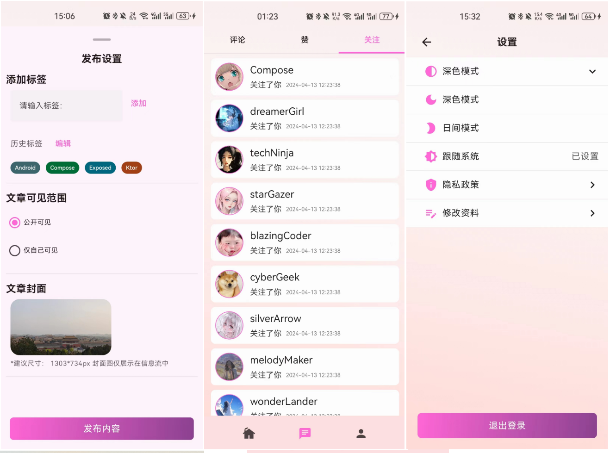
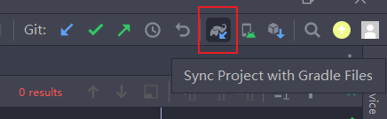
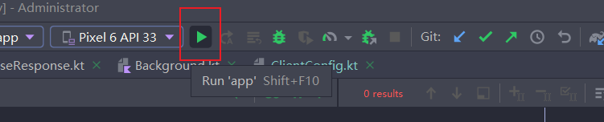

Lunimary Blog Android App
==================

**Lunimary Blog是使用Jetpack Compose打造的一个现代化Android项目。网络请求通过Ktor实现（[Ktor后台项目](https://github.com/cenguofei/Luminary-background-system)）**

# Screenshots

## The Dark Mode Screens


## The Light Mode Screens


## More Screenshots see directory <a href ="https://github.com/cenguofei/Luminary-android/tree/main/docs/images">

# Architecture

The **Lunimary Blog** app follows the [official architecture guidance](https://developer.android.com/topic/architecture).

# UI
The app was designed using [Material 3 guidelines](https://m3.material.io/).
The Screens and UI elements are built entirely using [Jetpack Compose](https://developer.android.com/jetpack/compose).

The app has two themes:

- Dark Theme -  uses predefined dark colors.
- Light theme - uses predefined light colors.

# How to run this app?
- clone the project use [Android Studio](https://developer.android.com/studio)
- run the background system: [Ktor Lunimary](https://github.com/cenguofei/Luminary-background-system)
- configure the java/com/example/lunimary/base/ktor/ClientConfig.kt
```kotlin
/**
 * [查看电脑ip地址](https://baijiahao.baidu.com/s?id=1794155473080003356&wfr=spider&for=pc)
 */
const val HOST = "10.129.72.21" // change yo your own host.
const val PORT = 8080
const val BASE_URL = "http://$HOST:$PORT"
```
- Sync Project

  

- Run Project

  
